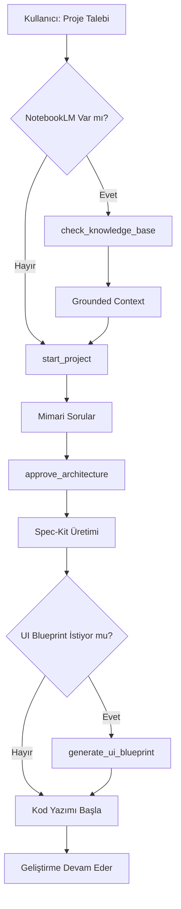

# DevForge MCP Server v3.0

**AI-Powered Software Factory with NotebookLM & A2UI Integration**

## 🚀 Genel Bakış

DevForge MCP, yapay zeka destekli tam kapsamlı bir yazılım geliştirme orkestratörüdür. Model Context Protocol (MCP) üzerinden Claude Code/Desktop ile entegre çalışır ve fikirden üretime kadar tüm yazılım geliştirme sürecini yönetir.

**Version:** 3.0.0  
**GitHub:** https://github.com/Srhot/AI-Tools/tree/main/devforge-mcp-server  
**License:** MIT

---

## ✨ v3.0 Yeni Özellikler

### 🆕 NotebookLM Entegrasyonu
- **Grounded Context**: NotebookLM knowledge base'den citation-backed bilgi
- **Otomatik Fallback**: NotebookLM yoksa klasik AI generation
- **Smart Search**: Proje ile ilgili dokümantasyon otomatik arama

### 🆕 A2UI (Agent-to-UI) Generator
- **Cross-Platform**: React, Flutter, React Native, Web, Angular, Console
- **44+ Widget Katalog**: Hazır UI component library
- **JSON Blueprint**: Framework-agnostic UI tanımları
- **Code Generation**: Otomatik React/Flutter kod üretimi

### 🔧 İyileştirmeler
- **API Key Priority**: Gemini-first (GEMINI → ANTHROPIC → OPENAI)
- **TypeScript Module Resolution**: Bundler mode
- **Enhanced Documentation**: Kapsamlı kullanım rehberi

---

## 🛠️ MCP Araçları

### Mevcut Araçlar (11)

| Araç | Açıklama | Yeni |
|------|----------|------|
| `start_project` | Proje başlat, karar matrisi oluştur | |
| `approve_architecture` | Spec-Kit üret (docs + POML) | |
| `check_knowledge_base` | NotebookLM'de bilgi ara | ✅ v3.0 |
| `generate_ui_blueprint` | A2UI cross-platform UI | ✅ v3.0 |
| `generate_api_tests` | Postman/Newman testleri | |
| `ask_frontend_questions` | Frontend platform seçimi | |
| `generate_frontend_prompt` | Google Stitch/Lovable/v0 | |
| `generate_bdd_tests` | Cucumber/Gherkin tests | |
| `create_checkpoint` | Manuel checkpoint | |
| `get_workflow_status` | İlerleme durumu | |
| `complete_task` | Görev tamamla (auto checkpoint) | |

---

## 📦 Proje Yapısı

```
devforge-mcp-server/
├── src/
│   ├── adapters/          # AI provider adapters (Gemini, Claude, OpenAI)
│   ├── modules/           # Core modules (orchestrator, spec-kit, etc.)
│   ├── integrations/      # NotebookLM MCP client [v3.0]
│   ├── generators/        # A2UI generator + catalog [v3.0]
│   ├── templates/         # Mustache templates
│   └── index.ts           # Main MCP server
├── build/                 # Compiled output
├── docs/                  # Documentation
├── .env.example           # Environment template
├── USAGE_GUIDE.md         # Detailed usage instructions [v3.0]
├── CLAUDE_CODE_CONFIG.md  # Claude configuration guide
└── README.md              # Project overview
```

---

## 🎯 Desteklenen Özellikler

### Proje Tipleri
- ✅ Web Applications (React, Vue, Angular, Next.js)
- ✅ API Services (REST, GraphQL, gRPC)
- ✅ CLI Tools (Node.js, Python, Go)
- ✅ Desktop Apps (Electron, Tauri)
- ✅ Mobile Apps (React Native, Flutter) [Enhanced v3.0]
- ✅ Libraries/Packages

### AI Providers
- 🥇 **Gemini** (default, recommended)
- 🥈 **Claude** (high quality)
- 🥉 **OpenAI** (balanced)

### UI Platforms (A2UI)
- React
- Flutter
- React Native
- Web Components
- Angular
- Console/CLI

---

## 🔗 İş Akışı



---

## 📊 Çıktılar

### Spec-Kit Dosyaları
- `CONSTITUTION.md` - Proje anayasası
- `SPECIFICATION.md` - Detaylı özellikler
- `TECHNICAL_PLAN.md` - Teknik mimari plan
- `TASKS.md` - Görev listesi (ID'li)
- `PROJECT.poml` - POML manifest

### A2UI Dosyaları
- `blueprint.json` - UI blueprint
- `messages.jsonl` - Streaming messages
- Generated code (React/Flutter/etc.)

### Test Dosyaları
- Postman collections
- Newman CLI scripts
- Cucumber/Gherkin features

---

## 🚀 Hızlı Başlangıç

### 1. Kurulum
```bash
git clone https://github.com/Srhot/AI-Tools.git
cd AI-Tools/devforge-mcp-server
npm install
npm run build
```

### 2. Konfigürasyon
```bash
cp .env.example .env
# .env dosyasına GEMINI_API_KEY ekleyin
```

### 3. Claude Code Entegrasyonu
`claude_desktop_config.json`:
```json
{
  "mcpServers": {
    "devforge": {
      "command": "node",
      "args": ["path/to/build/index.js"],
      "env": {
        "AI_PROVIDER": "gemini",
        "GEMINI_API_KEY": "your-key"
      }
    }
  }
}
```

### 4. Kullanım
```
Claude Code'da:
"DevForge MCP ile bir todo uygulaması oluştur"
```

Detaylı kullanım için: [USAGE_GUIDE.md](./USAGE_GUIDE.md)

---

## 📈 İstatistikler

| Metrik | Değer |
|--------|-------|
| **Version** | 3.0.0 |
| **MCP Tools** | 11 (9 existing + 2 new) |
| **AI Providers** | 3 (Gemini, Claude, OpenAI) |
| **A2UI Widgets** | 44+ |
| **UI Platforms** | 6 |
| **Lines of Code** | ~3,500+ |
| **TypeScript Files** | 25+ |

---

## 🤝 Katkıda Bulunma

Issues ve Pull Requests GitHub'da environment:
https://github.com/Srhot/AI-Tools/issues

---

## 📝 Lisans

MIT License - Serhat Sezgül © 2026

---

## 🔗 Bağlantılar

- **GitHub Repo:** https://github.com/Srhot/AI-Tools/tree/main/devforge-mcp-server
- **Kullanım Rehberi:** [USAGE_GUIDE.md](./USAGE_GUIDE.md)
- **Claude Konfigürasyonu:** [CLAUDE_CODE_CONFIG.md](./CLAUDE_CODE_CONFIG.md)
- **Gemini Setup:** [GEMINI_SETUP_GUIDE.md](./GEMINI_SETUP_GUIDE.md)

---

**DevForge MCP v3.0** - Turning AI conversations into production-ready software infrastructure 🚀
